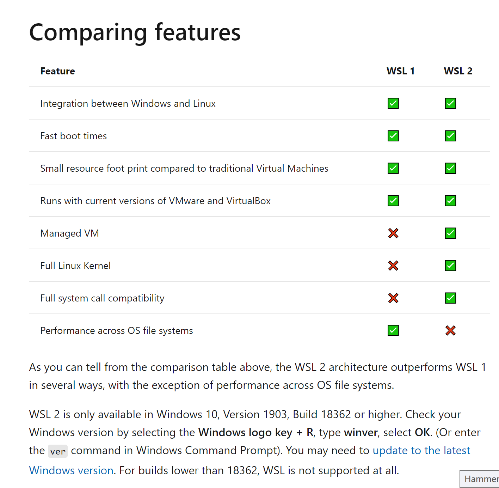
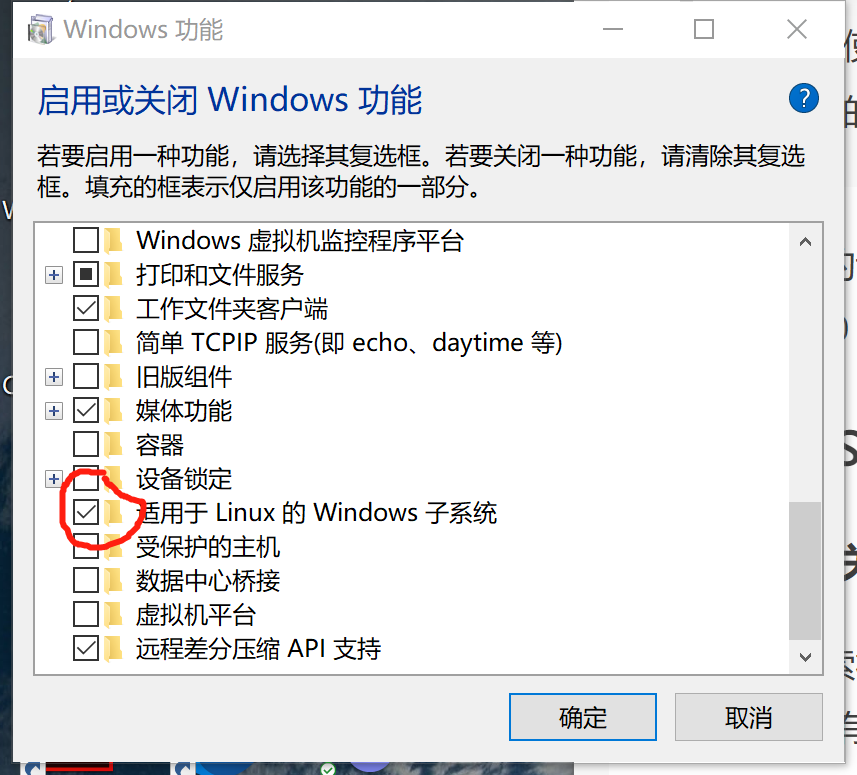
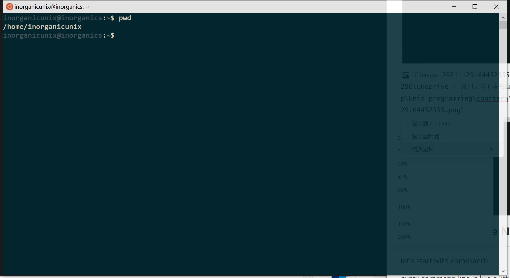
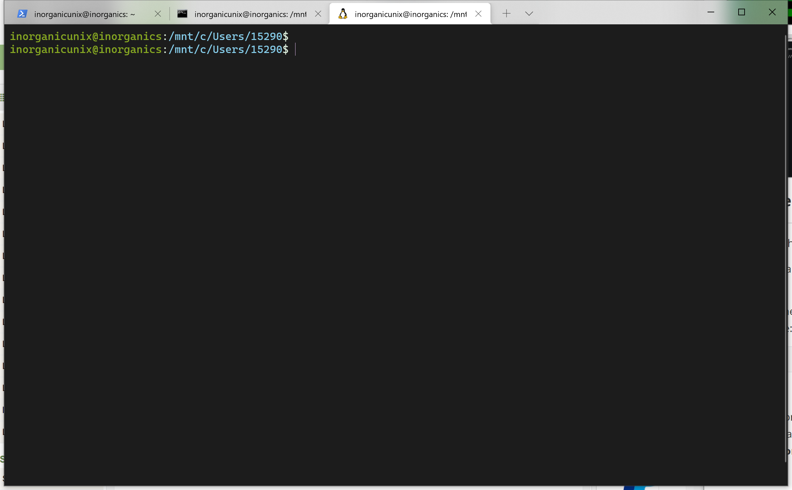
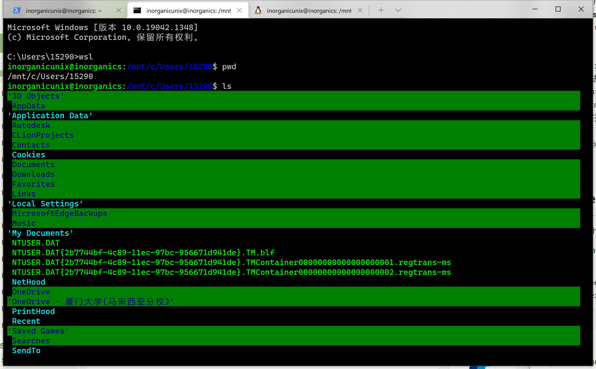
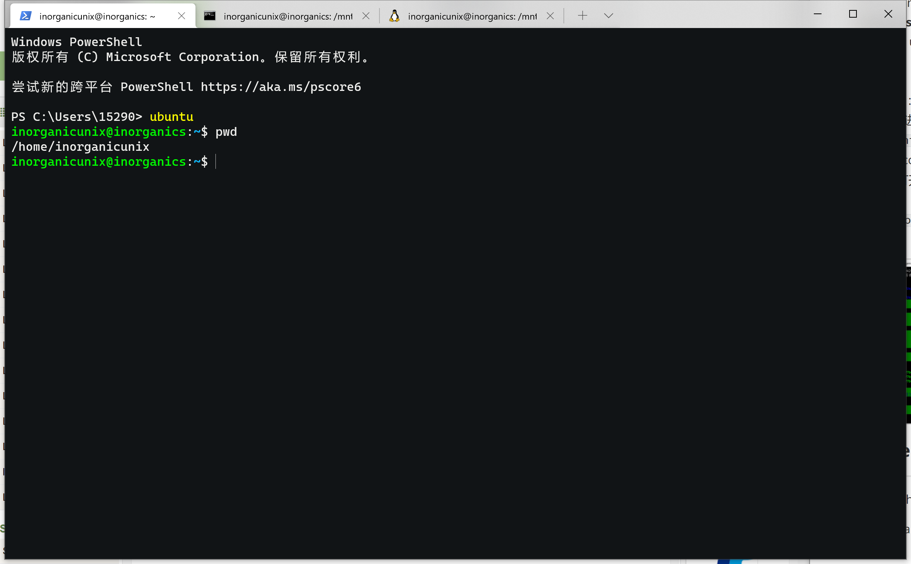
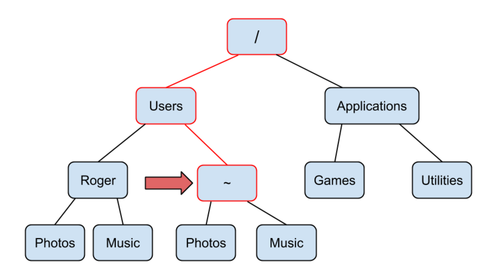

## **UNIX programming course on COURSERA**

#### *Some configurations before we get into the main context*

----------
#### Preface(good to know)
-----

- **Quick Q&A**

1. **What's the default bash program on Windows,Linux and MacOS?**

A: cmd, bash and zsh.


   2.**What is GUN/Linux**?

A: some takeaways:

1.    GUN/Linux is a more specified/accurate name rather than Linux; and the GNU org. wants to inspire the spirit of free software/freedom of usage or development
2.    Linux is a kernel, functioned/activated based on GNU(GNU's Not Unix) OS; it cannot run with itself;
3.    Linux is developed by GNU project;
4.    Linux distributions is actually GNU/Linux distributions

FOR more details, see also in this [website](https://www.gnu.org/gnu/linux-and-gnu.en.html) 

------


- **We can install the *windows subsystem for Linux(WSL)* instead of using dual OS or virtual machine, which is a waste of a memory if there is not too much work on the bash. **

Here is the difference between WSL1 and WSL2

> 


**You need to click on this tab as you wish to install WSL in your Windows OS**



Encounter problems? Here are some troubleshooter pages ：

- Refer to [this](https://answers.microsoft.com/en-us/windows/forum/all/microsoft-store-error-code-0x80131500/41d2d363-83ee-4b5d-ba43-615ca63bb1bf) if you got trouble in accessing the Microsoft Store 

- refer to [this](https://www.jianshu.com/p/3e627ff45ccb)  for installation

- this is the [official guide](https://docs.microsoft.com/zh-cn/windows/wsl/setup/environment#set-up-your-linux-user-info)

After successful installation, you can check the version

```bash
zsh --version
```

you can also see all bash that you got now

```bash
cat /etc/shells
```

----------

You can also easily switch the bash :

```bash
chsh -s /bin/bash
```

```bash
chsh -s /bin/zsh
```


- right now we may have many terminals, you can integrate them together with **Windows Terminal**, which supports cross-platform usages, including cmd/ubuntu/....

**P.S.: control+L 另起一页！很有用啊**

**Unsolved Questions:**

有什么不同？：在windows terminal中的cmd进入到wsl， 我进入到的是window里面的文件夹 `inorganicunix@inorganics:/mnt/c/Users/15290$` ，但是cd后会回到 `/home/inorganicunix` ；在wt里面打开Ubuntu也是一样。但是如果直接打开Ubuntu，不通过wt，那么初始所在的路径是在 `/home/inorganicunix`；在wt的powershell里打开也是一样。为什么呢？显示如下图






目前猜测：

因为是通过Linux 补全只能在自己的目录下？？


# **Fist Week Outline Notes**

-----

let's start with command line command

Every command line is like a little computer program; all command line commands all tend to have the structure like:

```bash
[command] [options] [argurments]
```


Options are preceded by a **hyphen(-)**; arguments can be like **files/raw data/directory.** 


#### -Navigating the command line

hierarchy of folders("directories" in Unix)

home directory(includes personal files) $\equiv$ "~"



- Here are some basic commands

`cd`

`pwd`

`ls`

`cd ..`  //go back to the upper dir.

Let's applied them in real senario.

We can change directory into any folders can be typed(absolute path) exactly in the [arguments]  with "`~/[directory]`" 

```bash
cd ~/Music
pwd
## /user/inorganic/Music
```


If you are not sure about what you wanna enter, and have no idea that what is in the current folder, you can try pressing the **Tab**;

```
cd ~/
```

(double) press the **Tab** to see what is inside of the selected folder

```bash
cd ~/[seletced folder] //press the tab 
## ## Desktop
## Documents
## Photos
## Music
## todo.txt       (just an example here )
```

If you want to find the file/folders which is lead with some characters, for example ".vim", you can type "`cd ~/.vim`" then press **Tab** to find the  specified one.

```bash
inorganicunix@inorganics:/mnt/c/Users/15290$ ls ~/
.123.txt.swp               .landscape/                .viminfo                   zsh-syntax-highlighting/
.bash_history              .motd_shown                .vimrc
.bash_logout               .profile                   .zcompdump
.bashrc                    .sudo_as_admin_successful  .zshrc

inorganicunix@inorganics:/mnt/c/Users/15290$ ls ~/.vim
.viminfo  .vimrc
```

##### Summary

- You can identify a specific file or folder by its path.

- The root directory (/) contains all of the folders and files on your computer.

- Your home directory (~) is the directory where your terminal always starts.

- Use the cd command to change your working directory.

- The pwd command will print the working directory.

- The ls command will list files and folders in a directory.

  ------

#### -Creation and Inspection

`mkdir` i.e, ***make directory***

let's try it! Remember that the "Code" here is an **[argument]** phrase.

```bash
inorganicunix@inorganics:/mnt/c/Users/15290/My Documents$ ls
'My Music'  'My Pictures'  'My Videos'
inorganicunix@inorganics:/mnt/c/Users/15290/My Documents$ mkdir Code
inorganicunix@inorganics:/mnt/c/Users/15290/My Documents$ ls
 Code  'My Music'  'My Pictures'  'My Videos'
inorganicunix@inorganics:/mnt/c/Users/15290/My Documents$
```

The most simple way to create a blank file is using the **touch** cmd;

Sometimes it's to complicated to distinguish the files and directories with a single `ls` cmd, then the [-option] function can specify our needs. 

`ls -l`

Let's be coherent.

```bash
inorganicunix@inorganics:/mnt/c/Users/15290/My Documents$ cd Code
inorganicunix@inorganics:/mnt/c/Users/15290/My Documents/Code$touch ablankfile2.txt
inorganicunix@inorganics:/mnt/c/Users/15290/My Documents/Code$ls
ablankfile2.txt
inorganicunix@inorganics:/mnt/c/Users/15290/My Documents/Code$ls -l
total 0
-rwxrwxrwx 1 inorganicunix inorganicunix 0 Nov 30 13:54 ablankfile2.txt
```

`-rwxrwxrwx` is a **l**ong sting combined with 10 characters, which stands for different meanings correspondingly.

The first character represents the attributes of the file/dir.; the following three blocks correspond to the authorities of**Owner/ Members_of_group_that_owner_in/ Others**

 [Here](https://blog.csdn.net/LEON1741/article/details/82386520/) is a completed instruction for dummies.


Now if you want to see the detailed info of a specific file, such like we have already created just now, try this. (I've type in some meaningless words in the file)

```bash
inorganicunix@inorganics:/mnt/c/Users/15290/My Documents/Code$wc ablankfile2.txt
  5  19 117 ablankfile2.txt
```

The first "5" is line; "19" is the total words;"117" is total characters.

let's create a text file with a long content, which is a usual scenario in the real life cases, literally, TLCR :(

```bash
inorganicunix@inorganics:/mnt/c/Users/15290/My Documents/Code$touch Homeric_Hymns.txt
inorganicunix@inorganics:/mnt/c/Users/15290/My Documents/Code$vi Homeric_Hymns.txt
Error detected while processing /home/inorganicunix/.vimrc:
line    2:
E492: Not an editor command: rscheme ron
Press ENTER or type command to continue
inorganicunix@inorganics:/mnt/c/Users/15290/My Documents/Code$ cat Homeric_Hymns.txt
Homer, Iliad, Book 1, lines 1-52

Sing, goddess, the anger of Peleus? son Achilleus........
.................
.................
```

I create a file includes an excerpt of ***Homeric Hymns***, just try to implicate demonstrate a very large text file that can hardly read. See how the following commands make an entrance.

Use `wc` to incept the basic info.

```bash
inorganicunix@inorganics:/mnt/c/Users/15290/My Documents/Code$wc Homeric_Hymns.txt
  54  577 3119 Homeric_Hymns.txt

```

Hum, that's a big one isn't it?

If we simply use the `cat` to get all the content, too long to acquire the key point that we want. `head` is for showing the first 10 lines, we can also set it manually, with the option `-n 5` behind, meaning get the first 5 lines. `cat -c 50`is for asking the first 50 words, and similarly, you can deduce the `tail` and `less`.(`less` would take over your entire terminal window)


You can also refuse to use `vi` as there is only one line to insert in a (new) file, if you find it tooo noxious to open up vim editor, `echo.. >..`and `echo.. >>.. ` are here for you. That also omit the create-file process for you.

```bash
inorganicunix@inorganics:/mnt/c/Users/15290/My Documents/Code$ echo "this line was echo into the file echo-out" > echo-out.txt
inorganicunix@inorganics:/mnt/c/Users/15290/My Documents/Code$ ls
Homeric_Hymns.txt  echo-out.txt
ablankfile2.txt
inorganicunix@inorganics:/mnt/c/Users/15290/My Documents/Code$ cat echo-out.txt
this line was echo into the file echo-out
```

As you can see, a now file named by you with `echo` is also created simultaneously. This technique is called **output redirection**.

> One easy way to create a file is using **output redirection**. Output redirection stores text that would be normally printed to the command line in a text file. You can use output redirection by typing the greater-than sign (>) at the end of a command followed by the name of the new file that will contain the output from the proceeding command. 


You can use `cat ..>>..` to insert/append a sentence at the end of the content.

```bash
inorganicunix@inorganics:/mnt/c/Users/15290/M
y Documents/Code$ echo "this line was appended "nics:/mnt/c/Userecho "this line was appended
into the file echo-out.txt by 'echo >>' techui
que" >> echo-out.txt
inorganicunix@inorganics:/mnt/c/Users/15290/My Documents/Code$ cat echo-out.txt
this line was echo into the file echo-out
this line was appended into the file echo-out.txt by 'echo >>' techuique
inorganicunix@inorganics:/mnt/c/Users/15290/My Documents/Code$
```


- **WARNING!!**

  IF you want to append another line to the end of echo-out.txt, so typed echo "A third line." > echo-out.txt into the terminal when really I meant to type echo "A third line." >> echo-out.txt**(notice I used > when I meant to use >>)**.  The previous content would be covered by the current inputs.

  -------

#### -Text Editor

- **vim and emacs** // two prevailing text editor in the world.


